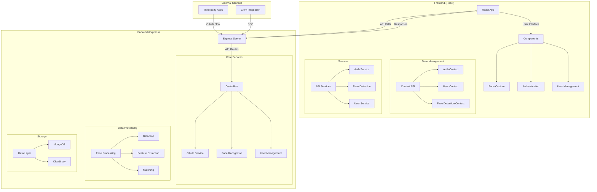
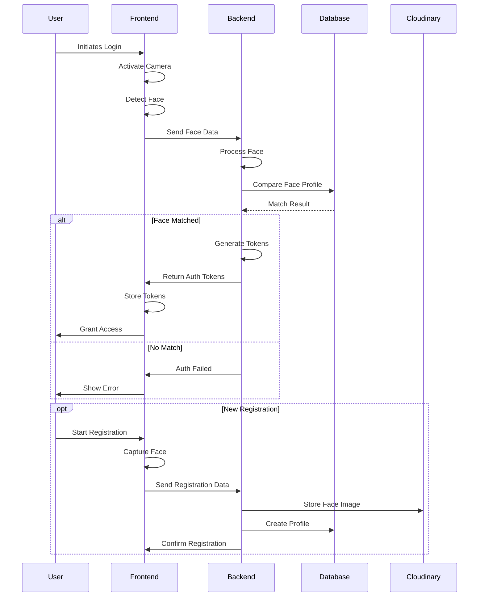

# 🔐 FaceAuth SSO Platform

A modern Single Sign-On (SSO) platform with facial authentication, combining React frontend and Express backend to provide secure, face-based authentication services.

## 🌟 Why FaceAuth SSO?

FaceAuth SSO stands out by offering:
- 👤 Biometric authentication through face recognition
- 🔒 OAuth 2.0 & OpenID Connect compliance
- ⚡ High-performance architecture with React and Express
- 🌐 Seamless integration capabilities
- 🎯 Enhanced security with multi-factor auth
- ☁️ Cloud-native design with Vercel deployment

## 🏗️ System Architecture



## 🔧 Technical Stack

### Frontend (React)
- ⚛️ React with Vite
- 🎨 Tailwind CSS
- 📸 face-api.js for client-side face detection
- 🔄 Context API for state management
- 🌐 Axios for API communication

### Backend (Express)
- 🚀 Node.js & Express
- 🔑 JWT & Session-based auth
- 📦 MongoDB with Mongoose
- ☁️ Cloudinary for image storage
- 👤 face-api.js for face recognition

## 📁 Project Structure

```
face-auth-sso/
├── src/                   # Frontend React app
│   ├── components/       # React components
│   ├── contexts/        # Context providers
│   ├── services/        # API services
│   └── assets/          # Static assets
│
├── server/              # Express backend
│   ├── controllers/     # Route controllers
│   ├── middleware/      # Custom middleware
│   ├── routes/         # API routes
│   ├── services/       # Business logic
│   └── utils/          # Utilities
│
└── vercel-server/      # Vercel deployment
    ├── config/         # Server config
    ├── controllers/    # API controllers
    └── services/       # Core services
```

## 🔄 Authentication Flow



## ⚙️ Setup & Installation

### Prerequisites
- Node.js ≥ 14
- MongoDB instance
- Cloudinary account

### Frontend Setup
```bash
# Install dependencies
npm install

# Start development server
npm run dev
```

### Backend Setup
```bash
# Navigate to server directory
cd server

# Install dependencies
npm install

# Start server
npm run dev
```

### Environment Configuration

#### Frontend (.env)
```env
VITE_API_URL=http://localhost:5000
VITE_FACE_MATCH_THRESHOLD=0.6
```

#### Backend (.env)
```env
MONGODB_URI=your_mongodb_uri
CLOUDINARY_CLOUD_NAME=your_cloud_name
CLOUDINARY_API_KEY=your_api_key
CLOUDINARY_API_SECRET=your_api_secret
JWT_SECRET=your_jwt_secret
SESSION_SECRET=your_session_secret
```

## 🚀 Deployment

### Frontend
```bash
# Build frontend
npm run build

# Deploy to Vercel
vercel
```

### Backend
```bash
# Deploy server to Vercel
cd vercel-server
vercel
```

## 🔌 API Endpoints

### Authentication
- `POST /oauth/authorize` - Start OAuth flow
- `POST /oauth/token` - Get tokens
- `GET /oauth/userinfo` - Get user info

### Face Authentication
- `POST /face-auth/verify` - Verify face
- `POST /register-user` - Register new user

### User Management
- `GET /api/users` - List users
- `GET /api/users/:id` - Get user
- `PUT /api/users/:id` - Update user

## 🛡️ Security Features

- 🔒 JWT token encryption
- 👁️ Face recognition accuracy controls
- 🚫 CORS protection
- 🍪 Secure session management
- 📁 Secure file uploads
- 🔐 Rate limiting
- 🛑 Input validation

## 💡 Use Cases

1. **Enterprise SSO Integration**
   - Secure company-wide authentication
   - Multi-factor auth with face verification
   - Single sign-on across applications

2. **Identity Verification**
   - User verification for sensitive operations
   - Biometric authentication layer
   - Fraud prevention

3. **Access Control**
   - Physical access management
   - Secure area authentication
   - Attendance tracking

## 🎯 Unique Features

1. **Facial Biometrics**
   - Advanced face detection and recognition
   - Liveness detection
   - Anti-spoofing measures

2. **OAuth Provider**
   - Standard OAuth 2.0 implementation
   - OpenID Connect support
   - Dynamic client registration

3. **Cloud Architecture**
   - Serverless deployment
   - Scalable infrastructure
   - Cloud storage integration

## 🤝 Contributing

1. Fork the repository
2. Create a feature branch
3. Commit changes
4. Push to the branch
5. Open a pull request

## 📝 License

ISC

## 👨‍💻 Author

Dipan Dhali
