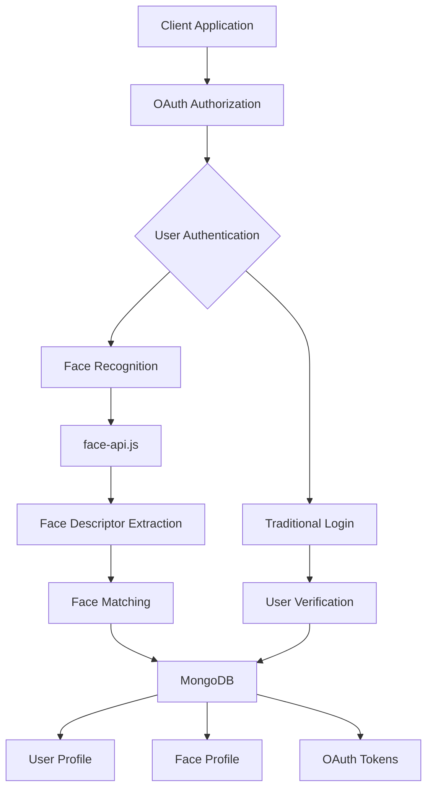

# Face Authentication SSO Service

A secure Single Sign-On (SSO) service with Face Authentication capabilities, built using Node.js, Express, MongoDB, and face-api.js.

## Features

- 🔐 OAuth 2.0 & OpenID Connect compliant SSO server
- 👤 Face-based authentication and registration 
- 🌐 Dynamic client registration
- 🔑 JWT-based token management
- ☁️ Cloud storage for face images using Cloudinary
- 🔄 Session management
- 📱 Mobile-friendly interface

## Architecture



## Technical Components

### 1. OAuth 2.0 & OpenID Connect Implementation
- Full OAuth 2.0 authorization code flow
- OpenID Connect extensions for identity verification
- Dynamic client registration support
- JWT-based ID tokens and access tokens
- Token introspection and revocation endpoints

### 2. Face Authentication System
- Powered by face-api.js for face detection and recognition
- TinyFaceDetector model for efficient face detection
- Face landmark detection for improved accuracy
- Face descriptor extraction and matching
- Configurable matching threshold (default: 0.6)

### 3. Database Schema

#### User Model
```javascript
{
  id: String,
  name: String,
  firstName: String,
  lastName: String,
  username: String,
  email: String,
  emailVerified: Boolean,
  phoneNumber: String,
  phoneNumberVerified: Boolean,
  faceVerified: Boolean,
  profilePicture: String,  // Cloudinary URL
  registeredAt: Date,
  updatedAt: Date,
  faceProfileId: String
}
```

#### Face Profile Model
```javascript
{
  userId: String,
  faceImagePath: String,
  faceDescriptor: Array,
  registeredAt: Date
}
```

#### OAuth Token Model
```javascript
{
  token: String,
  userId: String,
  clientId: String,
  scope: String,
  isRefreshToken: Boolean,
  expiresAt: Date
}
```

## Authentication Flow

1. **Client Authorization Request**
   - Client redirects user to `/oauth/authorize`
   - Server validates client credentials and redirect URI

2. **User Authentication**
   - New users are directed to registration
   - Existing users proceed to face authentication

3. **Face Authentication Process**
   - Camera access requested
   - Face detection and descriptor extraction
   - Matching against stored face profiles
   - Success triggers OAuth code generation

4. **Token Generation**
   - Authorization code exchanged for tokens
   - ID token contains user identity claims
   - Access token for API access
   - Optional refresh token for token renewal

## API Endpoints

### OAuth & OpenID Connect
- `/.well-known/openid-configuration` - OpenID Connect discovery
- `/oauth/register` - Dynamic client registration
- `/oauth/authorize` - Authorization endpoint
- `/oauth/token` - Token endpoint
- `/oauth/userinfo` - User information endpoint
- `/oauth/jwks` - JWK Set endpoint

### Face Authentication
- `/face-auth` - Face authentication page
- `/face-auth/verify` - Face verification endpoint
- `/register` - User registration
- `/register-user` - Registration submission

## Security Features

- CORS protection with credentials
- Session management with secure cookies
- JWT token signature verification
- Face matching threshold controls
- Temporary file cleanup
- Cloudinary secure image storage

## Setup

1. **Environment Variables**
   ```
   MONGODB_URI=your_mongodb_connection_string
   SESSION_SECRET=your_session_secret
   CLOUDINARY_CLOUD_NAME=your_cloudinary_cloud_name
   CLOUDINARY_API_KEY=your_cloudinary_api_key
   CLOUDINARY_API_SECRET=your_cloudinary_api_secret
   ```

2. **Install Dependencies**
   ```bash
   npm install
   ```

3. **Download face-api.js Models**
   - Place models in `public/models/` directory:
     - tiny_face_detector_model
     - face_landmark_68_model
     - face_recognition_model

4. **Start Server**
   ```bash
   npm start
   ```

## Default Client Configuration

```javascript
{
  clientId: 'face-auth-client',
  clientSecret: '2f4faadac82f1b78aec68aea3de330303f3aa90531222f35e656943e581aa118',
  redirectUris: [
    'http://localhost:5000/oauth/callback',
    'https://capable-boar-92.clerk.accounts.dev/v1/oauth_callback'
  ],
  grants: ['authorization_code'],
  scopes: ['openid', 'profile']
}
```

## Dependencies

- Express.js - Web framework
- MongoDB/Mongoose - Database
- face-api.js - Face detection/recognition
- jsonwebtoken - JWT handling
- Cloudinary - Image storage
- multer - File upload handling
- node-canvas - Image processing

## Error Handling

- Face detection failures
- Invalid client credentials
- Token validation errors
- Database connection issues
- File upload/storage errors

## Contributions

Feel free to submit issues and enhancement requests!

## License

MIT