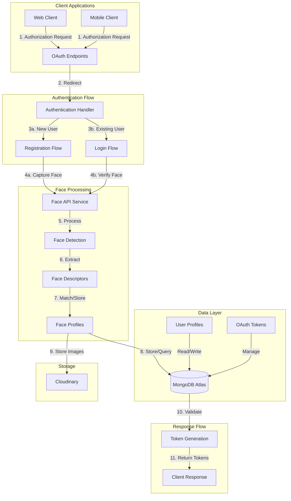

# 🔐 Face Authentication SSO Provider (Vercel)

A secure Single Sign-On (SSO) provider with face authentication capabilities, optimized for deployment on Vercel.

## 🌟 Key Features

- 🔑 OAuth 2.0 & OpenID Connect compliant SSO server
- 👤 Face-based authentication with face-api.js
- 🌐 Dynamic client registration support
- 🎟️ JWT token management
- ☁️ Cloudinary integration for face image storage
- 🔄 Secure session management
- 💾 MongoDB data persistence
- ⚡ Vercel-optimized deployment

## 🏗️ System Architecture



## 🛠️ Technical Stack

- **Runtime**: Node.js + Express
- **Database**: MongoDB Atlas
- **Face Processing**: face-api.js
- **Storage**: Cloudinary
- **Authentication**: JWT + Session-based
- **Deployment**: Vercel Serverless

## 📁 Project Structure

```
vercel-server/
├── config/         # Configuration files
├── controllers/    # Route controllers
├── middleware/     # Custom middleware
├── public/         # Static assets
├── routes/        # API routes
├── services/      # Business logic
├── utils/         # Utility functions
└── index.js       # Entry point
```

## ⚙️ Environment Variables

Create a `.env` file based on `.env.template`:

```env
# Cloudinary Configuration
CLOUDINARY_CLOUD_NAME=your_cloud_name
CLOUDINARY_API_KEY=your_api_key
CLOUDINARY_API_SECRET=your_api_secret

# MongoDB Connection
MONGODB_URI=your_mongodb_uri

# Security
SESSION_SECRET=your_session_secret
JWT_SECRET=your_jwt_secret
ADMIN_SECRET_TOKEN=your_admin_token

# Server Configuration
PORT=5000
NODE_ENV=production
```

## 🚀 Deployment

The project is configured for Vercel deployment using `vercel.json`:

```json
{
  "version": 2,
  "builds": [
    {
      "src": "index.js",
      "use": "@vercel/node"
    }
  ],
  "routes": [
    {
      "src": "/public/(.*)",
      "dest": "/public/$1"
    },
    {
      "src": "/(.*)",
      "dest": "/index.js"
    }
  ]
}
```

## 🔌 API Endpoints

### OAuth & OpenID Connect
- `/.well-known/openid-configuration` - Discovery endpoint
- `/oauth/authorize` - Authorization endpoint
- `/oauth/token` - Token endpoint
- `/oauth/userinfo` - User info endpoint
- `/oauth/jwks` - JWKS endpoint

### Face Authentication
- `/face-auth` - Face authentication interface
- `/face-auth/verify` - Face verification endpoint
- `/register` - User registration
- `/register-user` - Registration handler

### Admin & System
- `/api/admin/*` - Admin endpoints
- `/api/connection-status` - Health check

## 💽 Database Schema

### User Model
```javascript
{
  id: String,
  name: String,
  email: String,
  emailVerified: Boolean,
  faceVerified: Boolean,
  profilePicture: String,
  registeredAt: Date,
  updatedAt: Date,
  faceProfileId: String
}
```

### Face Profile Model
```javascript
{
  userId: String,
  faceImagePath: String,
  faceDescriptor: Array,
  registeredAt: Date
}
```

### Token Model
```javascript
{
  token: String,
  userId: String,
  clientId: String,
  scope: String,
  isRefreshToken: Boolean,
  expiresAt: Date
}
```

## 🔒 Security Features

- 🛡️ CORS protection with configurable origins
- 🍪 Secure session management
- 🎟️ JWT token verification
- 📸 Face matching threshold controls
- 🧹 Automatic temporary file cleanup
- ☁️ Secure cloud storage for images

## 🚀 Quick Start

1. Install dependencies:
```bash
npm install
```

2. Configure environment variables:
```bash
cp .env.template .env
# Edit .env with your configuration
```

3. Start development server:
```bash
npm run dev
```

4. Deploy to Vercel:
```bash
vercel
```

## 📚 Core Dependencies

- `express`: ^4.18.2
- `mongoose`: ^7.5.0
- `face-api.js`: ^0.22.2
- `cloudinary`: ^1.40.0
- `jsonwebtoken`: ^9.0.2
- `express-session`: ^1.17.3
- `multer`: ^1.4.5-lts.1
- `cors`: ^2.8.5

## 🔐 Authentication Flow

1. **Client Request**
   - Client redirects to `/oauth/authorize`
   - Server validates client credentials

2. **User Authentication**
   - New users → Registration flow
   - Existing users → Face verification

3. **Face Processing**
   - Capture face image
   - Extract face descriptors
   - Match against stored profiles

4. **Token Generation**
   - Generate authorization code
   - Exchange for access/refresh tokens
   - Return tokens to client

## 👥 Contributing

1. Fork the repository
2. Create a feature branch
3. Commit changes
4. Push to the branch
5. Submit a pull request

## 📄 License

ISC